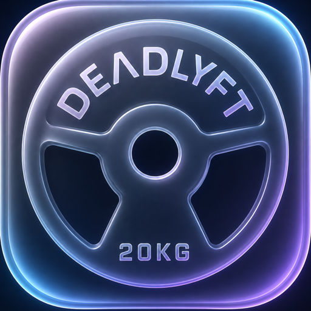
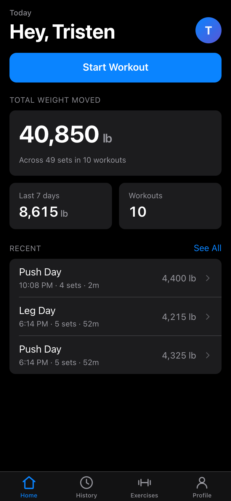
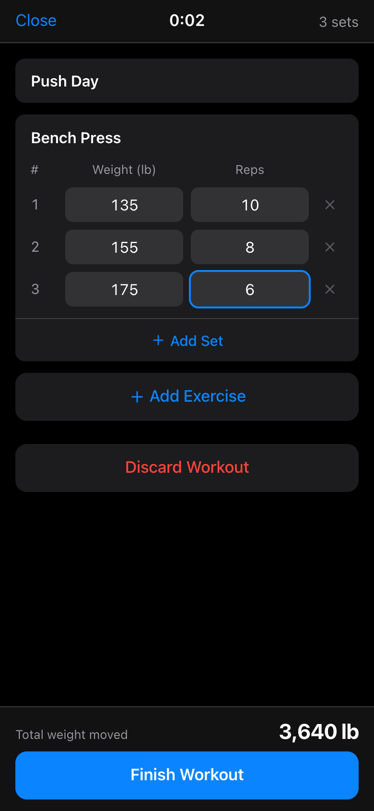
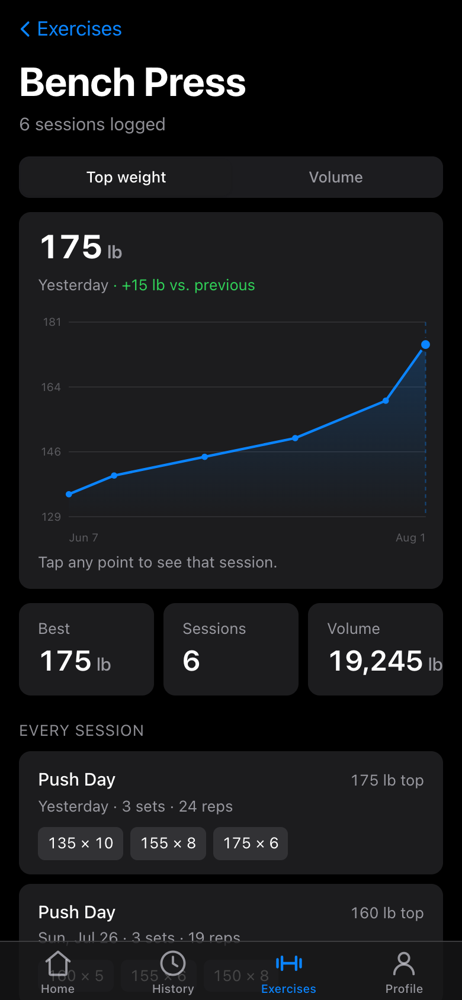
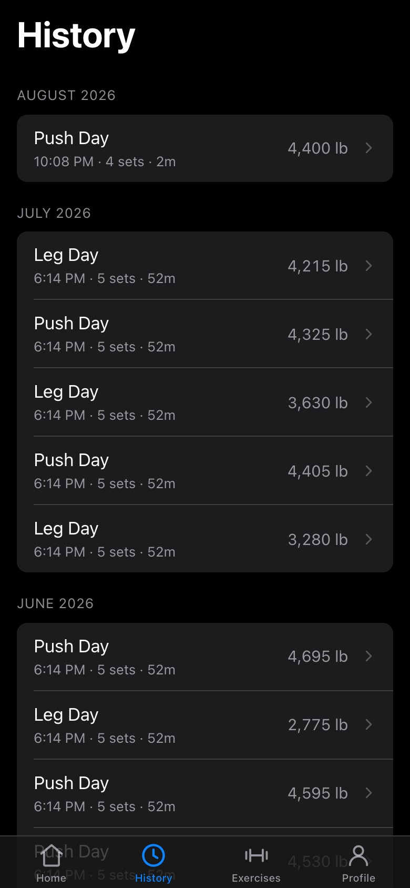
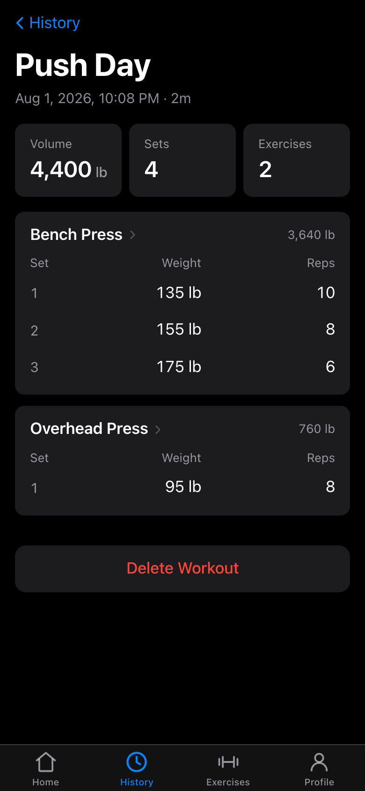
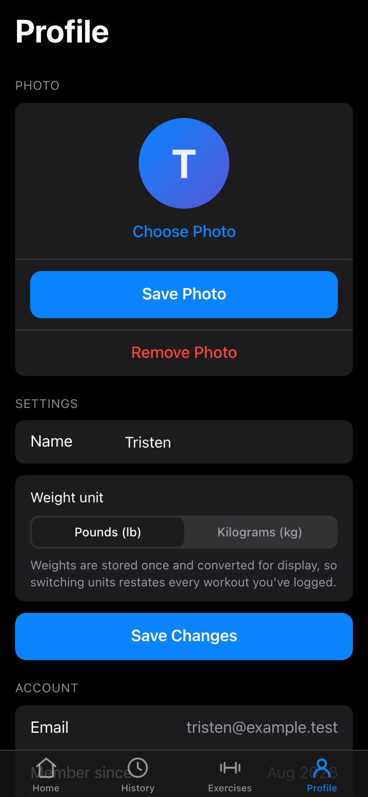

<p align="center">
  
</p>

<h1 align="center">DEADLYFT</h1>

A mobile-first workout tracker. Log your sets, reps and weight; every workout is
stamped with the date and time automatically and kept in a history you can look
back through. Each person gets their own account and their own private log.

Styled to feel like a native iOS app — Apple's semantic system colours, SF Pro,
inset grouped lists, a translucent tab bar, safe-area insets, automatic
light/dark mode. Add it to your iPhone home screen and it opens without Safari
chrome.

Built with Next.js 16, React 19, Tailwind v4, Prisma 7 and SQLite.

---

## Screenshots

| Home | Logging a workout | Progress over time |
| :---: | :---: | :---: |
|  |  |  |
| Lifetime and 7-day totals, plus recent sessions | Sets, reps and a live cumulative total | Top-set weight per session, with a Volume toggle |

| History | Workout detail | Profile |
| :---: | :---: | :---: |
|  |  |  |
| Every finished workout, grouped by month | Every set, with per-exercise volume | Photo, display name and weight unit |

<sub>Shown in dark mode with demo data. The app follows your phone's light/dark setting.</sub>

---

## What it does today

**Accounts**

- Email and password sign-up, with bcrypt-hashed passwords and 30-day session cookies
- Everyone's data is private to them: another user asking for your workout gets a 404
- A profile photo, or automatic initials on a colour derived from your name
- Choose pounds or kilograms; switching restates your entire history

**Logging a workout**

- Tap **Start Workout** and add exercises, then sets, then weight and reps
- **The name box offers movements you've already logged**, on focus and as you
  type, so the second time you do something you pick last time's name instead
  of inventing a near-miss spelling that splits the chart in two
- **Setup notes stay with the movement.** Seat height, pin, grip — write it
  once and it's there under the name every time you log it, instead of in a
  separate notes app or a photo of the machine you have to go and find
- **Load by plates instead of doing the sums.** Tap the plate button on a set
  and hit the plates you actually hung — it counts both sides and adds the bar,
  and shows its working ("45 × 2 per side + 45 bar = 225 lb"). One-sided
  machines and bar weights are a tap each, remembered per exercise.
- **Repeat** logs the set you just did again, because most sets after the first
  are the same set again
- **Cumulative weight moved** updates live as you type — the headline number
- A stopwatch runs while you train
- Start and finish times are recorded by the server, so nothing can be backdated
- Close the app mid-session and the workout stays open; Home offers to resume it
- **Nothing typed is lost by leaving the screen.** Wander off to History, reload
  the page, or have iOS kill the app between sets — the sets, the workout name
  and the cardio timers all come back, and a timer that was running is still
  running, with the time you were away counted
- Bodyweight movements work: leave the weight blank

**Cardio, in the same session**

- Tap **Add Cardio** inside a workout you already have going — it sits alongside
  the sets rather than in a separate log
- **Countdown** for a fixed block: set a target (or tap 5/10/15/20/30 minutes),
  and it stops itself at zero with a chime
- **Count Up** for an open-ended goal: start it and let it run
- Pause and resume; only the time actually running is counted
- Locking your phone doesn't lose time — the timers read the wall clock rather
  than counting ticks
- A workout can be nothing but cardio, so a run on its own is still a workout

**Your own measurements**

- **Body** — log your weight, height and body fat, as often or as rarely as you
  like. Fill in only the boxes you actually measured; height goes in once.
- A chart per measurement, so you can watch weight move over weeks rather than
  guess from the last number you remember
- Current weight, the change over the last 30 days, current body fat, your
  height and a derived BMI
- Back-date a weigh-in you took this morning and logged tonight
- Delete a mistyped reading so it doesn't sit in the chart forever

**Looking back**

- **History** — every finished workout, grouped by month, with volume, set count and duration
- **Workout detail** — the full set-by-set breakdown, with per-exercise volume,
  and what each cardio timer recorded
- **Exercises** — every movement you've logged, with your best-ever weight
- **Progress charts** — a line chart per movement showing top-set weight over
  time, with a Volume toggle. Tap any point to see that session and the change
  from the one before.
- Home shows lifetime weight moved, a 7-day total and your recent workouts

---

## Getting it running

You'll need **Node 20 or newer**.

```bash
npm install
cp .env.example .env
npx prisma generate
npx prisma migrate deploy
```

Then open `.env` and set a session secret — this signs the login cookie, so it
must not be blank:

```bash
openssl rand -base64 32
```

Paste the result as `SESSION_SECRET="..."`. Now start it:

```bash
npm run dev
```

Open <http://localhost:3000> and create an account.

### If it crashes on startup

If you see an error about a missing native module, `better-sqlite3` didn't
finish compiling — recent npm versions hold back dependency install scripts:

```bash
npm rebuild better-sqlite3
```

### Using it on your phone

Both devices need to be on the same Wi-Fi. Find this machine's address:

```bash
ipconfig getifaddr en0
```

Then open `http://<that-address>:3000` on your phone.

For real use rather than a quick look, run a production build instead. It's
dramatically lighter over Wi-Fi and has no dev tooling to go wrong:

```bash
npm run build && npm start
```

If you do use `npm run dev` from a phone, note that the dev server blocks
cross-origin requests to its own dev-only assets. Your phone is a different
origin than `localhost`, so its HMR socket gets refused, the page never
finishes hydrating, and anything driven by JavaScript silently does nothing —
while plain forms keep working, which makes it look like one specific button is
broken. `allowedDevOrigins` in `next.config.ts` already covers the usual home
router ranges to prevent this.

### Starting over

The database is a single file. To wipe everything and begin fresh:

```bash
rm dev.db && npx prisma migrate dev
```

To move your data to another machine, copy `dev.db` across — photos and all.

---

## How it fits together

| Area | Where |
| --- | --- |
| Database schema | `prisma/schema.prisma` |
| Prisma client + SQLite adapter | `src/lib/prisma.ts` |
| Session cookies (JWT via `jose`) | `src/lib/session.ts` |
| Auth checks / current user | `src/lib/dal.ts` |
| Optimistic route gating | `src/proxy.ts` |
| Server actions | `src/app/actions/` |
| Volume, units, exercise grouping | `src/lib/volume.ts`, `units.ts`, `exercises.ts` |
| Movement name keys, note limits | `src/lib/movements.ts` |
| Body measurements, height units, BMI | `src/lib/body.ts` |
| Plate denominations and loadout maths | `src/lib/plates.ts` |
| Cardio rules, shared wall clock | `src/lib/cardio.ts`, `clock.ts`, `chime.ts` |
| Draft shape + surviving a reload | `src/lib/drafts.ts` |
| Screens | `src/app/(app)/`, `src/app/log/[id]/` |
| Design tokens | `src/app/globals.css` |
| Maintenance scripts | `scripts/` (see [scripts/README.md](scripts/README.md)) |

### Maintenance scripts

| Command | What it does |
| --- | --- |
| `npm run icons` | Regenerates every icon from `assets/icon-source.png` |
| `npm run seed` | Fills the demo account with back-dated workouts and weigh-ins |
| `npm run screenshots` | Recaptures the screenshots above |

### Screens

- `/` — greeting, start/resume a workout, lifetime and 7-day totals, recent workouts
- `/log/[id]` — the live logger (full screen, no tab bar, like an iOS modal)
- `/history` — every finished workout, grouped by month
- `/workout/[id]` — a saved workout's full set-by-set breakdown
- `/exercises` — every movement you've logged, most recent first
- `/exercises/[name]` — progress chart for one movement, plus every session
- `/body` — weight, height and body fat over time, with the form to log them
- `/profile` — photo, display name, weight unit, account info, sign out
- `/api/users/[id]/photo` — a user's photo, authorized per viewer

---

## Design decisions worth knowing

**Weights are stored in kilograms, always.** Each user picks lb or kg and every
read path converts on the way out (`src/lib/units.ts`). Switching units
restates your existing history rather than reinterpreting the numbers.

**Cumulative volume is never stored.** Total weight moved is `reps × weight`
summed across sets, computed on read in `src/lib/volume.ts`, so it can't drift
out of sync with the sets it summarises.

**Timestamps come from the server.** `startedAt` is written when you tap Start
Workout and `finishedAt` when you tap Finish. The client never supplies either.

**Authorization lives next to the data.** `src/proxy.ts` redirects signed-out
traffic, but that check is optimistic — cookie only, no database, because it
runs on every request including prefetches. Every page and every server action
independently calls the DAL and re-checks ownership. Requesting someone else's
data returns 404, not 403, so existence isn't leaked either.

**Actions that need no client state are plain forms.** Starting a workout,
signing in, saving your profile and uploading a photo are all `<form
action={...}>` in a Server Component, so they submit as ordinary HTML POSTs
even if the page hasn't hydrated. Only the submit button is a Client Component,
for the pending label. An `onClick` handler would have nothing to fall back on.
The logger itself genuinely needs JavaScript — it builds the whole workout in
client state before saving.

**Movements are matched case-insensitively, and the most common spelling wins.**
"Bench Press" and "bench press" are one movement (`src/lib/exercises.ts`), and
the name shown is whichever spelling you've used most often — so typing it in
lower case once doesn't rename months of history. Ties break toward the most
recent, so a deliberate rename still takes effect.

**The progress chart is hand-rolled SVG.** No charting library, so there's
nothing to keep up to date and it inherits the iOS palette for free. Its y-axis
deliberately does not start at zero — the chart is about change, and a zeroed
axis flattens every real difference. With a single session it draws one dot and
no line rather than implying a trend that isn't there.

**Profile photos live in the database, not on disk.** A `ProfilePhoto` row
holds the bytes, in its own table so a `findUnique` on `User` without an
explicit `select` can never drag an image into memory. Keeping them in SQLite
also means the whole app is still one file you can copy between machines.

**Photos are shrunk in the browser, and validated on the server.** The picker
centre-crops to a square, scales to 512px and re-encodes as JPEG before
uploading (a 327KB PNG becomes ~10KB). None of that is trusted:
`detectImageType` re-identifies the file from its magic bytes and accepts only
JPEG/PNG/WebP. That allowlist is the point — SVG is an XML document that can
carry script, and these bytes are served from our own origin, so an SVG
uploaded as `avatar.jpg` would be stored XSS. SVG has no binary signature, so
it can never match.

**Photo responses revalidate rather than cache.** `Cache-Control: private` only
bars *shared* caches; the browser's own is expressly allowed. With a long
`max-age`, a photo outlives the session, so on a shared phone the next person
to sign in could still load the previous user's photo from disk. The route
sends `private, no-cache, must-revalidate` with an ETag, so the browser keeps
its copy but must revalidate — which re-runs authorization — and unchanged
photos come back as a bodyless 304.

**Slugs are encoded and decoded in one place.** Next hands dynamic route
segments over *still percent-encoded*, so `exerciseSlug` / `decodeExerciseSlug`
are a matched pair. This is what makes a movement called "Pull-up / Chin-up"
work as a URL.

**Cardio is its own table, not an `Exercise` with zero-weight sets.** Folding it
into `Exercise` would have been less schema, but every strength query would then
have had to start excluding it: cardio has no reps and no weight, so it would
contribute nothing to volume while still appearing on the Exercises list as
"Treadmill — best weight 0 lb" next to a flat progress chart. `CardioEntry`
keeps `src/lib/volume.ts`, `exercises.ts` and `stats.ts` exactly as narrow as
they were.

**Which timer ran is derived, not stored.** A `CardioEntry` has `durationSec`
and a nullable `targetSec`; a countdown is one that has a target, and it hit
that target when `durationSec >= targetSec`. A separate `mode` column would have
been a second source of truth that could disagree with the numbers — the same
reasoning as volume never being stored.

**Cardio timers read the wall clock; they never count ticks.** Elapsed time is
derived from when the current run started plus what earlier runs banked
(`cardioElapsedMs` in `src/components/CardioTimer.tsx`). A phone suspends
JavaScript timers the moment the screen locks, so an interval that decremented a
counter would quietly lose every minute the phone spent in a pocket. Subtracting
timestamps cannot. A countdown that runs out banks exactly its target rather
than whatever it overshot to, so a 20-minute block records as 20:00.

**One clock drives every live readout.** `useNow` in `src/lib/clock.ts` is a
single `useSyncExternalStore` over the wall clock, shared by the workout
stopwatch and every cardio timer, so they advance on the same tick instead of
drifting against each other. It ticks faster than the one-second granularity
anything displays, which costs a few identical renders and buys readouts that
change in the second they belong to.

**A workout can be nothing but cardio.** `finishWorkout` requires at least one
exercise *or* at least one cardio entry, not one exercise. A run on its own is
a workout, and the count-up timer exists precisely for it.

**Duplicate movements are prevented at the keyboard, not repaired later.**
Case and surrounding whitespace already collapse to one movement, but
"Chest Press" and "Machine Chest Press" don't, and nothing after the fact can
tell whether that was a slip or a real distinction — by then there are two
half-length charts and no way to know which sessions belonged to which. So the
name box offers what you've logged before: on focus, most recent first, because
the common case is repeating last week's movement and recognising a name beats
remembering how you spelled it. An exact match hides the list, since there's
nothing left to suggest.

The rules that turn a name into a key live in `src/lib/movements.ts` rather
than `exercises.ts`, which is `server-only` because it queries. Both sides of
the wire have to agree on what counts as the same movement, and the logger
applies them in the browser as you type.

**Setup notes belong to the movement, not to the workout.** A seat height is a
standing fact about you and that machine, not something that happened on
Tuesday, so `MovementNote` is one row per movement keyed on the same normalised
name that history groups under — which is what makes it show up when you type
the name a month later. Storing one per session instead would mean re-entering
it every time, and would leave "what is it set to" as a search back through
history.

It follows that a note is not a foreign key to anything. Exercise names are
free text with no movements table to point at, and the note has to outlive
every workout that mentions it — discarding the session you wrote it in
shouldn't throw the setting away. An empty note deletes its row rather than
storing a blank, so "no note" has exactly one representation.

Free text rather than fields for seat, pin and pad, because no two machines
agree on what they even have to set. Reading is the case that matters — you're
standing at the machine — so the note shows in full without being tapped, and
only editing is behind the tap.

**The plate panel writes a number and keeps nothing.** It only ever sets the
set's weight — no plate breakdown is stored on the set, and nothing about it
reaches the database. A weight loaded by tapping plates and the same weight
typed in are the same weight, which is what keeps volume, charts and history
from having to know the panel exists.

What it does hold, while it's open, is *which* plates you tapped, because a
total doesn't say how it was made up: 20 + 20 a side and 25 + 15 a side both
come to 40, and redrawing your two 20s as a 25 and a 15 would be telling you
something untrue about your own bar. Those remembered plates are trusted only
while they still add up to what's in the field — type a weight over the top and
they no longer do, so the panel falls back to decomposing the number you typed.
That same decomposition is what lets it open already showing the last set's
loading, so adding one more plate is a single tap.

A weight that no set of plates makes — a machine's stack number, or something
odd typed by hand — decomposes to nothing rather than to an approximation. The
panel then shows nothing loaded, and the next plate tapped starts a clean
total. Better to admit it doesn't know than to draw a bar that was never built.

**Plate maths runs in tenths of a unit, and in display units.** Tenths because
2.5 has no exact binary representation and eight of them should come to 20, not
19.999999999999996. Display units because you load a 45 lb plate, not a 20.4 kg
one — converting first would put fractions on every button. The resulting total
is converted to kilograms by the same path a typed weight takes.

**Bar and per-side settings live on the exercise, not the workout.** One
session realistically mixes a barbell (bar 45, both sides), a leg press (bar 0,
both sides) and the odd single-horn machine, so anything coarser means
re-answering the question every few sets. They ride along in the draft and are
optional, so a draft written before the panel existed still restores.

**A body measurement is one row, not one column.** `BodyMetric` is a long,
narrow table — user, kind, value, timestamp — rather than a wide row per
measuring session with a nullable column per metric. You rarely measure
everything at once, so those rows would be mostly nulls, and "what is my
current height" would become a hunt for the newest row where that column
happened to be filled in. One row per reading makes each metric an independent
time series, which is exactly the shape the chart wants, and adding a waist
measurement later is an enum value rather than a migration.

The price is that `value` carries no unit of its own: it means kilograms,
centimetres or percent depending on `kind`. That mapping is written down once,
in `BODY_METRICS` in `src/lib/body.ts`, and nothing outside that file reads a
raw value without going through it.

**Height has no unit setting of its own.** It follows the weight preference —
lb gives you two boxes for feet and inches, kg gives you one for centimetres —
so there is one unit question in the app instead of two nearly identical ones.
Someone who wants kilograms with feet isn't served, which is the deliberate
trade. Storage is canonical centimetres regardless, for the same reason weights
are canonical in kilograms.

Height plots in whole inches for an imperial user rather than feet and inches,
because a chart axis needs a single number and 5′ 11″ isn't one.

**Measurement dates come from the client, unlike workout times.** A workout's
`startedAt` is whatever the server clock said, because it records something the
app watched happen. A weigh-in is something you did before you opened the app,
and logging this morning's number tonight is the normal case — so the date
picker is real, bounded server-side to "not in the future".

That date is parsed from its parts rather than with `new Date("2026-07-15")`,
which reads a bare date as UTC midnight; anywhere west of Greenwich that lands
on the previous day in local time, and this morning's weigh-in charts as
yesterday. Today keeps the live clock so two weigh-ins on one day stay in the
order they were entered, and any earlier day is pinned to local noon, far
enough from both midnights that a daylight-saving shift can't move it.

**BMI is derived and deliberately uncategorised.** It is computed from the
latest weight and height on read, never stored — the same rule as volume. It's
shown as a bare number with no "normal/overweight" label attached, because BMI
cannot tell muscle from fat, and in an app whose entire purpose is adding
muscle that label would be worse than no label.

**The in-progress draft is mirrored to localStorage, not to the database.**
Autosaving to the server would mean a write per keystroke and `Exercise` rows
existing for workouts that were never finished; keeping the draft in the browser
leaves `finishWorkout` a single wholesale write. It's localStorage rather than
sessionStorage because sessionStorage dies with the tab, and "iOS killed the app
while I was reading a text between sets" is the case most worth surviving.

Because a cardio timer stores *when* it started rather than how long it has run,
a restored timer is still running, and the time spent away is already in the
number. Nothing has to keep ticking for that to be true.

**The draft is read through `useSyncExternalStore`, not an effect.** The logger
is server-rendered, so reading storage while rendering would make the client's
markup disagree with the server's, and pushing the draft in from an effect means
initialising the form empty and overwriting it a moment later. Instead the store
reports `undefined` until storage has been read — the server render and the
hydration pass — and the form is remounted on a `key` once the answer is known,
so its state is simply *created* from the draft. Same reasoning as the wall
clock in `lib/clock.ts`: a browser system the app reads is a store, not state
the app owns.

Two things this has to get right, both of which were wrong first:

- **The empty form must not save during that window.** On a full page load the
  form is mounted, empty, before storage has been read; without the `canSave`
  guard its mount saves an empty draft over the real one and the restore finds
  nothing. It only ever went wrong on a reload — arriving by a client-side
  navigation skips the empty mount entirely.
- **The cached snapshot is written through by `saveDraft`.** `useSyncExternalStore`
  needs a snapshot that doesn't change identity between calls, so storage is
  parsed once; leaving it at that meant closing the logger and reopening it
  restored the draft as it was on arrival and discarded everything typed since.

**Timers correct themselves when you come back rather than drifting.** A hidden
tab has its intervals throttled, and a locked phone stops firing them almost
entirely, so every live readout goes stale while you're away. None of them
*lose* anything, because all are computed from timestamps — and `lib/clock.ts`
ticks on `visibilitychange` so the right number is already on screen by the time
you look at it. The one thing a web app can't do here is sound the countdown
chime while the tab is hidden; it fires when the tab wakes.

---

## Future features

### Friends

See what the people you train with are doing, and give the app a social pull.

Roughly what it needs:

- A `Friendship` table with a requester, an addressee and a status
  (pending / accepted / blocked), unique on the pair
- Finding people — search by email, or an invite link, so you don't have to
  enumerate users
- A request-and-accept flow, so nobody can add themselves to your feed
- A friends list, and a read-only view of a friend's recent workouts and totals
- Probably a feed on Home: "Sam finished Leg Day — 12,400 lb"

Two things are already in place for this:

- **`canViewPhoto(viewerId, ownerId)` in `src/lib/photos.ts`** is the single
  authorization seam for profile photos. It currently reads
  `viewerId === ownerId`; it becomes
  `viewerId === ownerId || areFriends(viewerId, ownerId)` and every caller
  inherits it.
- **`Avatar`** already falls back to initials, which is what a friends list
  needs for people who haven't set a photo.

One thing to decide deliberately when this lands: **body measurements should
not ride along with workouts.** Volume and workout counts are the sociable
numbers; someone's weight and body fat are the ones they may well not want a
training partner reading, and a feed that shares them by default is a feed
people quietly stop using. Whatever `areFriends` unlocks, `BodyMetric` should
stay behind its own explicit opt-in, or out of the friends view entirely.

Worth deciding early: how much a friend can see. Totals and workout names are a
gentler default than every set of every session, and it's much easier to loosen
that later than to tighten it.

### Cardio progress, machine settings, and an effort score

Three things that only really work as one arc: cardio gets the same
progress-over-time treatment the lifts have, it records what the machine was
actually set to, and those settings become a single number worth plotting.

**Progress charts for cardio.** Nearly everything needed already exists.
`ProgressChart` is metric-agnostic — it takes `ChartPoint[]` and a toggle — and
`src/lib/exercises.ts` already solves the hard part of grouping free-text names
(`exerciseKey` for case-insensitive matching, `pickDisplayName` for choosing
which spelling to show). Cardio names need exactly the same treatment, so that
grouping is worth lifting out of `exercises.ts` rather than copying. What's new
is a `getCardioSummaries` / `getCardioHistory` pair over `CardioEntry`, and
`/cardio/[name]` routes mirroring `/exercises/[name]`.

The open UI question is where it lives. The Exercises tab lists movements, the
tab bar already has four items, and cardio isn't a movement — a Lifts/Cardio
segmented control on the Exercises tab is probably the cheapest answer.

**What the machine was set to.** Treadmill has speed and incline, an elliptical
has resistance, a bike has resistance and cadence, a rower has a split. The
temptation is a JSON blob; the better fit for this codebase is a fixed set of
nullable numeric columns on `CardioEntry`, because a blob can't be queried,
can't be type-checked, and can't be charted without parsing every row.

Two things to settle before writing the migration:

- **Units have to be canonical**, the way weights are kilograms everywhere and
  convert on read. Speed stored in kph with mph as a display preference is the
  direct parallel, and `src/lib/units.ts` is where it belongs.
- **A single speed for a session is a lie if you did intervals.** Either the
  columns explicitly mean *average* (simple, honest if labelled, and what most
  apps do), or `CardioEntry` grows a segments table. Worth deciding early —
  it's much easier to add segments to averages than to retrofit meaning onto
  numbers already collected.

**The effort score.** This is the part to be careful with. The README already
argues that estimated 1RM was left out because a computed figure needs
explaining, and a homemade `speed × incline × time` index is far more arbitrary
than 1RM — it isn't comparable between two machines, and it invites trusting a
number that nothing supports.

The way to make it defensible is to not invent it. The **ACSM metabolic
equations** turn treadmill speed and grade into an oxygen cost, which converts
to **METs**, and MET-minutes is a real, published, explainable unit that makes a
treadmill session genuinely comparable to a bike session. Effort should then be
*derived on read* from the stored settings and duration, exactly as volume is
derived from sets — so improving the formula restates the whole history instead
of stranding old rows on an old version of it.

Its honest limitation, worth writing on the screen rather than hiding: incline
and speed have physics behind them, but machine resistance levels do not.
"Level 8" on one elliptical is not level 8 on another and no published mapping
exists, so a resistance-based score is only ever comparable to itself. That is
still useful for tracking your own progress, and it is not a cross-machine
strain metric — presenting it as one would be the mistake.

Kilocalories need bodyweight, and as of the Body screen the app has it: the
most recent `WEIGHT` reading via `getLatestMetric` in `src/lib/body.ts`. Two
things follow. Use the weight recorded *nearest the session being scored*
rather than today's, or every past workout silently restates itself every time
you step on the scale. And handle the user who has never logged a weight —
MET-minutes still work without one, so kilocalories should be the part that
quietly disappears, not the whole score.

### Coaching over MCP

Expose a user's own logged data through an MCP server, so an agent can read
their training history and give advice grounded in what they've actually done —
"your bench has stalled for three weeks", "you haven't trained legs since the
14th" — rather than in generic programming.

Roughly what it needs:

- Read-only tools over the same data the app already derives: workout history,
  per-movement sessions and progress (`src/lib/exercises.ts`), lifetime and
  trailing-week totals (`src/lib/stats.ts`), cardio time
- A resource or tool for "what has this person done lately", shaped for a model
  to read rather than for a chart to plot

The thing to settle first is **authentication**, because nothing in the app is
built for a non-browser caller today. Authorization currently runs through
`getCurrentUser()` in `src/lib/dal.ts`, which reads a session cookie, plus a
per-row `userId` check at every query. An MCP server has no cookie. It needs its
own credential — a per-user token the profile screen can issue and revoke — and
it must resolve that token to exactly one user id and then go through the same
DAL checks, so the MCP path can never see more than the person signing in would.
Scope it to the caller's own data only; a friends feature would widen that
later, and it's far easier to loosen than to tighten.

### Other ideas

Unordered, and all optional — prune freely:

- **Edit a finished workout.** Right now a saved workout can only be deleted.
  Fixing a typo'd weight means re-logging the whole thing.
- **Search on the Exercises list.** Fine at five movements, unwieldy at fifty.
- **Merging two movements that should have been one.** The name suggestions
  stop new duplicates, but they can't fix a pair already in the history. What
  that needs is a rename that rewrites every `Exercise.name` under one key, and
  a decision about which of the two notes survives.
- **A custom bar weight.** The panel offers 0/45/35 (0/20/15 in kg), which
  misses a trap bar or a 33 lb women's bar. Those still work by typing the
  total; a free-text bar field would cover them properly.
- **Carrying the last session's plates into the next one.** The panel already
  remembers the bar and sides per exercise within a workout, but starts from
  nothing next time. What "you benched 185 last Tuesday" needs is the exercise
  history that `src/lib/exercises.ts` already computes.
- **Estimated 1RM** as a third metric on the progress chart, alongside top
  weight and volume. Deliberately left out for now because it's a computed
  figure that needs explaining.
- **Rest timer** between sets, counting up from the last set you completed. Most
  of the machinery now exists — `useNow`, `CardioTimer`'s wall-clock maths and
  the chime — so this is mostly a question of where it belongs in the set row.
- **Distance and pace on cardio**, so a 5k is more than 27 minutes. A nullable
  `distanceM` on `CardioEntry`, canonical in metres for the same reason weights
  are canonical in kilograms — best done in the same pass as the machine
  settings above, since it's the same migration and the same unit question.
- **A smoothed weight trend.** Day-to-day bodyweight swings by a couple of
  pounds on water alone, so the raw line is noisier than the change it's
  describing. A trailing average plotted over the points would read the trend
  better — derived on read, like everything else.
- **Tape measurements** — waist, chest, arms. The schema already takes them:
  a new `BodyMetricKind` and a row in `BODY_METRICS`, no migration of existing
  data and no new screen.
- **Editing a measurement**, rather than deleting and re-logging it. Same gap
  as finished workouts have, and worth fixing in the same pass.
- **Routines / templates** — start a workout pre-filled with the exercises you
  always do on push day.
- **Personal-best badges** when a set beats your previous best for a movement.
- **Deploying it properly** so it's reachable without being on your home
  Wi-Fi. Note that file-backed SQLite doesn't survive serverless hosting —
  that would mean pointing the Prisma datasource at Postgres instead.
